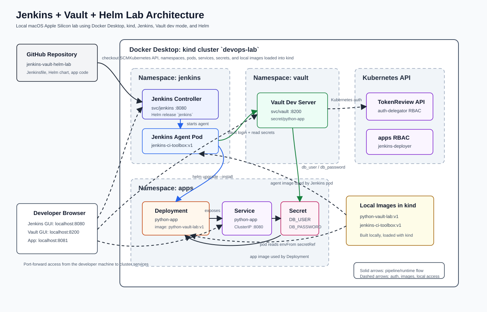

# Jenkins + Vault + Helm Lab

This repository contains a local DevOps lab for practicing a realistic deployment flow:

1. Jenkins runs inside a local Kubernetes cluster created with kind.
2. Jenkins starts a Kubernetes build agent that has `git`, `helm`, `kubectl`, and `vault`.
3. The Jenkins agent authenticates to HashiCorp Vault using the Kubernetes service account token.
4. Jenkins reads application secrets from Vault.
5. Jenkins deploys a Python Flask application to Kubernetes with Helm.

The lab is designed for macOS Apple Silicon with Docker Desktop.

Vault is installed in dev mode for learning only. It is insecure, uses the root token `root`, and loses data when the Vault pod restarts.

## Architecture



```text
GitHub repository
   |
   v
Jenkins controller in kind
   |
   v
Kubernetes Jenkins agent
   |
   +--> Vault dev server
   |
   +--> Helm deployment
           |
           v
        Python Flask app
```

## Repository Layout

```text
.
├── 01_lab_create_kind_jenkins_vault_helm_chart.md
├── 02_lab_execution_log.md
├── README.md
└── python-vault-lab/
    ├── Jenkinsfile
    ├── app/
    ├── chart/python-app/
    ├── ci/
    └── k8s/
```

## Components

- `kind`: local Kubernetes cluster named `devops-lab`
- `Vault`: HashiCorp Vault dev server in namespace `vault`
- `Jenkins`: Jenkins controller in namespace `jenkins`
- `jenkins-ci-toolbox:v1`: Jenkins agent image with CI tools
- `python-vault-lab:v1`: Python Flask application image
- `python-app`: Helm release deployed in namespace `apps`

## Current Lab State

The execution log is maintained in `02_lab_execution_log.md`.

At the last successful run:

- `vault` Helm release was deployed in namespace `vault`.
- `jenkins` Helm release was deployed in namespace `jenkins`.
- `python-app` Helm release was deployed in namespace `apps`.
- The app smoke test returned:

```text
DB_USER=admin
DB_PASSWORD_PRESENT=yes
```

## Access Jenkins

Start a port-forward:

```bash
kubectl -n jenkins port-forward svc/jenkins 8080:8080
```

Open:

```text
http://127.0.0.1:8080
```

Login:

```text
Username: admin
Password: retrieve it with the command below
```

You can retrieve the generated password again with:

```bash
kubectl exec --namespace jenkins svc/jenkins -c jenkins -- \
  /bin/cat /run/secrets/additional/chart-admin-password
```

## Access Vault

Start a port-forward:

```bash
kubectl -n vault port-forward svc/vault 8200:8200
```

Open:

```text
http://127.0.0.1:8200
```

Login:

```text
Method: Token
Token: root
```

Check Vault from the command line:

```bash
kubectl -n vault exec vault-0 -- sh -c '
  export VAULT_ADDR=http://127.0.0.1:8200
  export VAULT_TOKEN=root
  vault status
  vault kv get secret/python-app
'
```

## Access the Python App

Start a port-forward:

```bash
kubectl -n apps port-forward svc/python-app 8081:8080
```

Open or curl:

```bash
curl http://127.0.0.1:8081
```

Expected response:

```text
DB_USER=admin
DB_PASSWORD_PRESENT=yes
```

## Verify the Cluster

Check all Helm releases:

```bash
helm list -A
```

Check the main namespaces:

```bash
kubectl get pods,svc -n vault
kubectl get pods,svc -n jenkins
kubectl get pods,svc,secrets -n apps
```

Check the app rollout:

```bash
kubectl -n apps rollout status deploy/python-app
```

Run the same in-cluster smoke test used during validation:

```bash
kubectl -n apps run smoke-test \
  --rm \
  -i \
  --restart=Never \
  --image=python-vault-lab:v1 \
  --image-pull-policy=IfNotPresent \
  --command -- python -c 'import urllib.request; print(urllib.request.urlopen("http://python-app:8080/").read().decode())'
```

## Jenkins Pipeline Setup

The Jenkinsfile is in:

```text
python-vault-lab/Jenkinsfile
```

Create a Jenkins Pipeline job:

1. Start a Jenkins port-forward from your terminal:

```bash
kubectl -n jenkins port-forward svc/jenkins 8080:8080
```

2. Open the Jenkins GUI in your browser:

```text
http://127.0.0.1:8080
```

3. Sign in with username `admin`.
4. Retrieve the admin password if needed:

```bash
kubectl exec --namespace jenkins svc/jenkins -c jenkins -- \
  /bin/cat /run/secrets/additional/chart-admin-password
```

5. Select `New Item`.
6. Name it `python-vault-lab`.
7. Select `Pipeline`.
8. Under `Definition`, select `Pipeline script from SCM`.
9. Select `Git`.
10. Repository URL:

```text
https://github.com/xaviervincent11/jenkins-vault-helm-lab.git
```

11. Branch specifier:

```text
*/main
```

12. Script path:

```text
python-vault-lab/Jenkinsfile
```

13. Save and run `Build Now`.

Because this repository is public, HTTPS is the simplest Jenkins SCM URL. If you use the SSH URL instead, Jenkins must have both an SSH credential and a trusted GitHub host key configured; otherwise the build can fail with `Host key verification failed`.

The pipeline should:

- start a Kubernetes Jenkins agent using `jenkins-ci-toolbox:v1`
- authenticate to Vault with the `jenkins` service account
- read `secret/python-app`
- deploy the Helm chart into the `apps` namespace
- run an HTTP smoke test inside the cluster

## Rebuild Local Images

From `python-vault-lab/`:

```bash
docker build -t python-vault-lab:v1 ./app
kind load docker-image python-vault-lab:v1 --name devops-lab

docker build -t jenkins-ci-toolbox:v1 ./ci
kind load docker-image jenkins-ci-toolbox:v1 --name devops-lab
```

## Notes

- Jenkins does not build Docker images in this lab.
- Docker images are built locally and loaded into kind.
- Vault dev mode is intentionally simple and not production-safe.
- The values in this repository are lab/demo secrets only.
